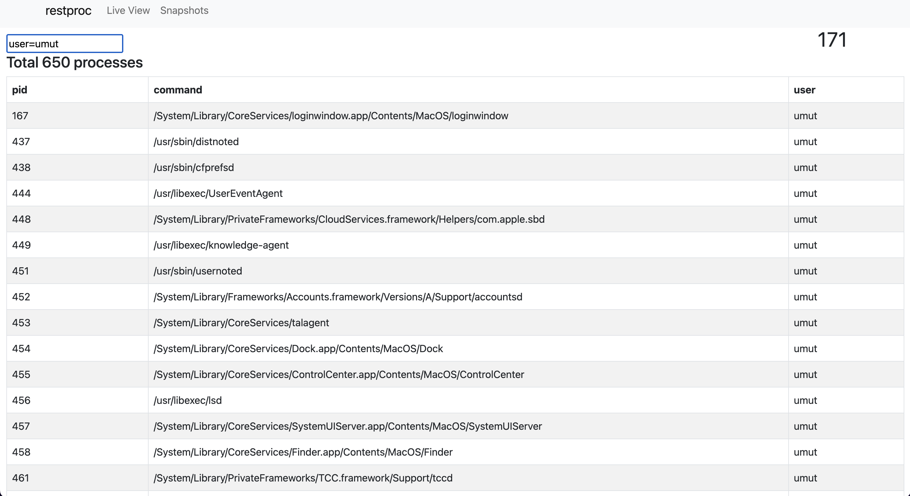

# How to install and use


## 1) Run postgres
You can use your local one but if you need to use with docker you have to disable your's
to prevent port collision. If you'll use your postgres, make sure credentials are OK. `api/procrest/src/main/resources/application.properties`

```bash
docker run \
    --rm \
    --name procrest-db \
    -e POSTGRES_USER=postgres \
    -e POSTGRES_PASSWORD=pass \
    -p 5432:5432 \
    postgres

```

## 2) Run the backend

```
cd web/api/procrest
mvn spring-boot:run
```

## 3) Run frontend


```
cd web
yarn run dev
```

# Features

- View your processes on live
- Snapshot a moment and view it later.

# Screenshots

## Live View





## Snapshots


